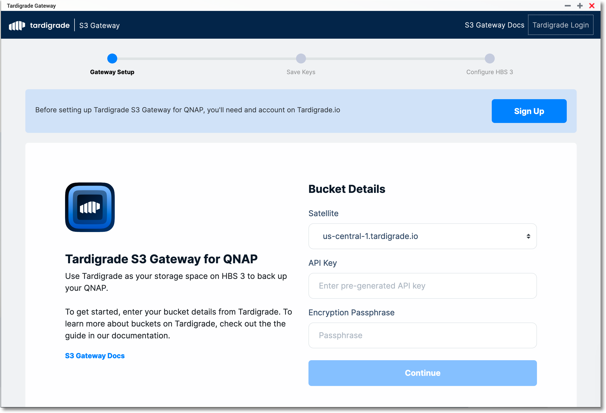
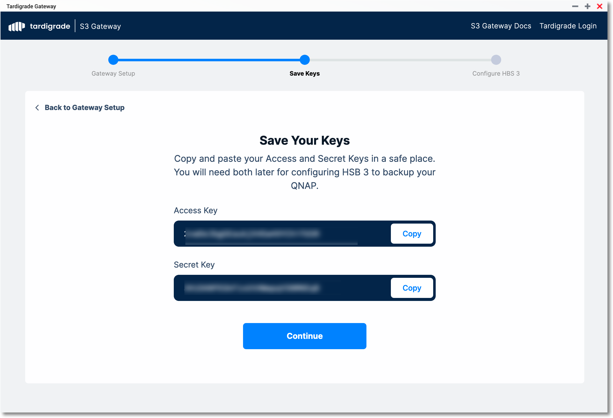
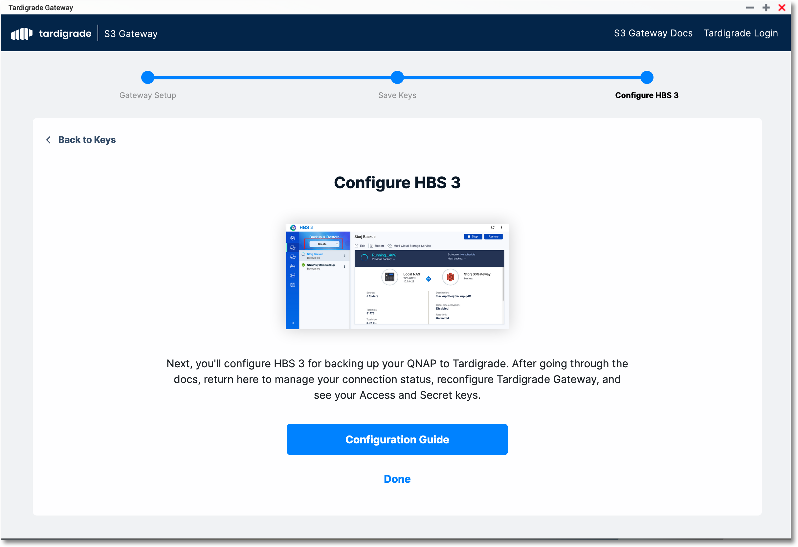
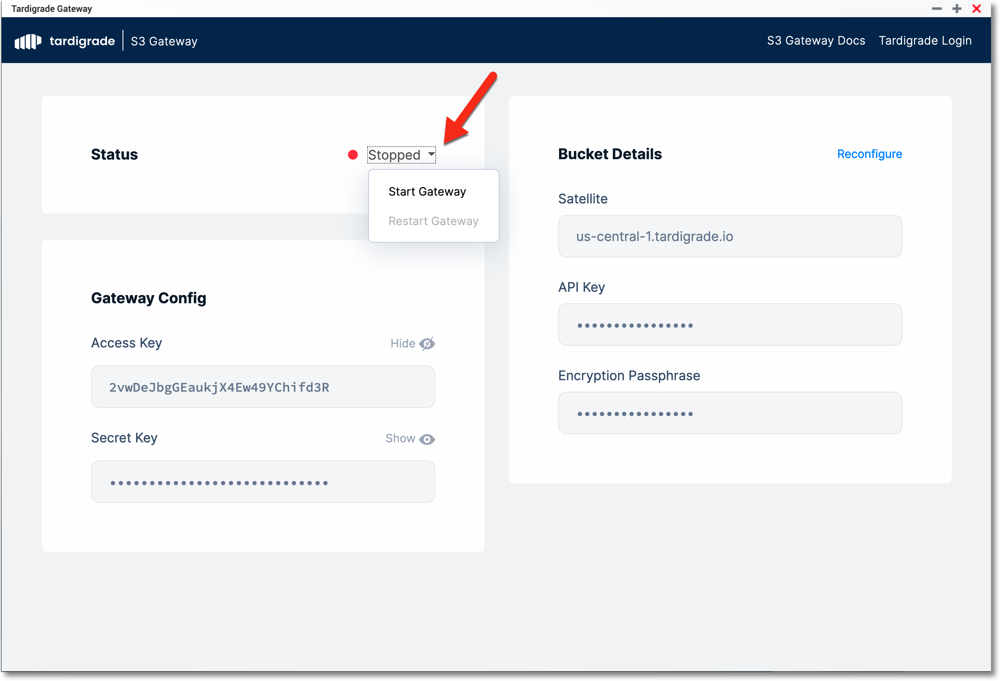
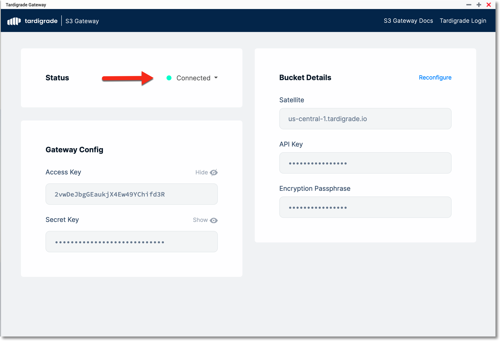
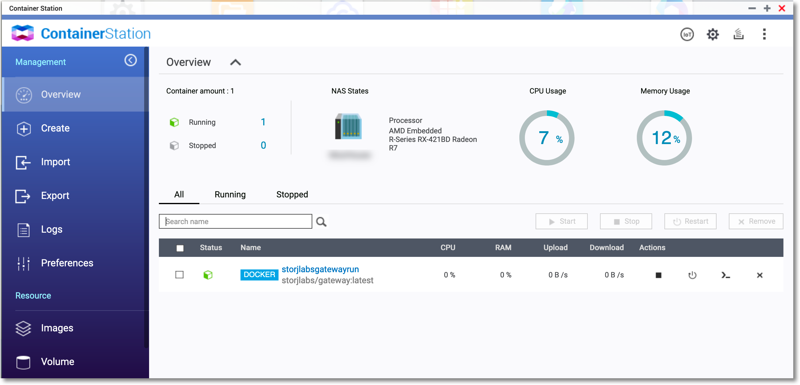

# QNAP Gateway User Guide

## Install App

https://github.com/storj-thirdparty/qnap-gateway-app/releases

## Configure Gateway

1. 

   Enter your Tardigrade API Key and desired encruption passphrase

   

2. 

   Copy your Access Key and Secret Key for use with your S3-compatiable Application(HBS3, etc.)

   

1. 

   Click 'Done'.  If you are configuring for HBS3 you can view the configuration guide specific to HBS3 by clicking the link in the app.

   
2. 

   Gateway will be in a "Stopped" state by default.  Select the drop-down and start the gateway.

   
3. 

   Once the gateway is started the status will be updated.

   If you ever need to get more information(debugging, etc.) you can view the logs and other status items in Container Station:

